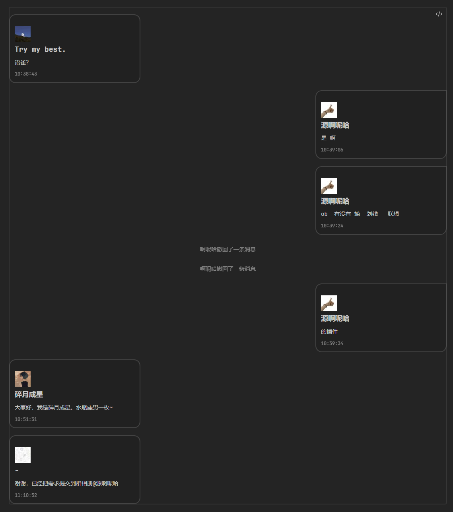

## 说明

保存了原插件的功能，不用同时使用两个插件
version-by 是版本是魔改基于的原版版本
version 是魔改版本

```json
{
	"id": "obsidian-qq-chat-view",
	"name": "QQ Chat View（LincZero魔改）",
	"version-by": "1.2.1",
	"version": "0.3.3",
	"minAppVersion": "0.15.0",
	"description": "魔改于QQ Chat View，可以直接复制QQ聊天记录中的信息，实现自动渲染",
	"author": "LincZero",
	"isDesktopOnly": false
}
```

## 使用示例

==保留了原插件的功能，详见`README 原版.md`，这里仅演示魔改后新增的功能==

使用：（复制代码块里的内容，不要复制代码块）

````
```chat-qq
{self=自己的昵称，例如群友1}
[群友1=群友1的QQ, 群友2=群友2的QQ, 群友3=群友3的QQ]

群友1 10:38:43  
语雀？  

群友2 10:39:06  
是 啊

群友2 10:39:24  
ob  有没有 输  划线   联想  
  
群友2撤回了一条消息  
  
群友2撤回了一条消息  
  
群友2 10:39:34  
的插件  
  
群友3加入本群。  
  
群友3 10:51:31  
大家好，我是群友3。水瓶座男一枚~

...
  
群友4 11:10:52  
谢谢，已经把需求提交到群相册
```
````

效果：

原效果



## 样式问题


## Bug

待新增功能：

- 不指定某人QQ时，随机给每个人生成一个不与他人重复的头像（否则指定起来有点麻烦，不制定的话默认都是企鹅头像）
- 根据头像选区主题色，对对话框进行着色


当前已知bug：
- 会影响正则判断的问题
    - 不能取一些奇奇怪怪的群昵称
    - 不要发送奇奇怪怪的内容，比如发送日期（复制的记录有歧义，无解）
    - 不要和其他群友起一样的名字，分辨不出来（复制的记录有歧义，无解）
- 腾讯字体加载错误，所以目前的字体会有点奇怪


## 更新日志

### v0.3.3，20221105

新增了 根据主题切换样式

新增了 指令：`{width:800}`（不要加px），能设置渲染的聊天记录的宽度

新增了 不指定QQ时使用默认头像

修复了 消息过短或过长时，样式会出现bug

### v0.3，20221104

新增了 仿QQ样式。但为了适配样式，修改了html元素结构，不兼容旧版

### v0.2，20221104

新增了 指令：`{slef:自己的名字}`，头像指定QQ，指定自己的功能

### v0.1，20221104

修复了 发送的消息不能换行（原插件不支持多行信息）

初始版本，只有最基础的功能，能识别QQ复制过来的聊天记录


