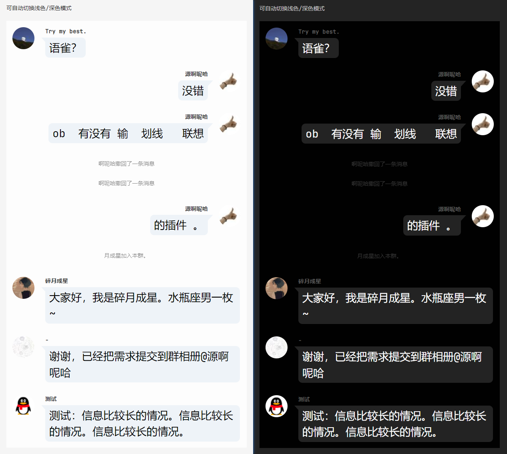

[English](./README.md) | 中文

## 说明

==该插件只是为了方便记录聊天记录，请勿用作伪造聊天记录以及犯罪用途==

目前支持的格式：
- qq
- wecaht (win & mac)
- telegram (win & mac)
- webvtt

Obsidian插件，魔改于 [obsidian-chat-view](https://github.com/adifyr/obsidian-chat-view)。
做了许多更适配中国使用的工作，如qq/wechat格式、智能头像、智能识别格式等

保存了原插件的功能，不需要同时使用两个插件<br/>
`version-by` 是版本是魔改基于的原版版本<br/>
`version` 是魔改版本

```json
{
	"id": "obsidian-chat-view-qq",
	"name": "Chat View QQ",
	"version-by": "1.2.1",
	"version": "0.5.0",
	"minAppVersion": "0.15.0",
	"description": "魔改于Chat View，可以直接复制QQ等平台聊天记录中的信息，并自动渲染聊天界面",
	"author": "LincZero | Aditya Majethia",
	"isDesktopOnly": false
}
```

## 使用示例

==保留了原插件的功能，原插件功能详见 [obsidian-chat-view](https://github.com/adifyr/obsidian-chat-view)，这里仅演示魔改后新增的功能==<br/>
==其他格式和更多扩展操作详见 [demo.md](./demo.md) 文件==

使用：（复制代码块里的内容，不要复制代码块）<br/>

QQ

````md
```chat-qq
{self=自己的昵称 例如群友1 可选, width=要渲染的宽度 可选, max-height=最大渲染高度 超出会边滚动框 可选, time=show表示显示消息发送时间}
[群友1=群友1的QQ, 群友2=群友2的QQ, 群友3=群友3的QQ 可选 不选就就默认分配头像]

【话唠】云猫猫 2022-11-11 18:38:25  
公猫？  

群友1 10:38:43  
语雀？  

群友2 10:39:06  
是啊
  
群友3加入本群。  
  
群友3 10:51:31  
大家好，我是群友3。水瓶座男一枚~

...

```
````

微信

````
```chat-wechat
{self=LincZero}

LincZero:
啊对

LincZero:
[动画表情]
```
````

效果：（V0.3.3新增的样式）



## 插件特点

- 复制即记录，无需过多的人工修改
  - 同时也保留了许多可选的自定义选项
- 相较于传统的长截图，有着占用内存低、方便修改内容、方便修改显示的比例的优点
- 可以很方便地记录：
  - 群友给你的灵感
  - 有自己QQ给自己发信息记录东西习惯的可以用这个来备份
  - 可以用来记录名人名言
  - 再次强调，不要用来伪造聊天用于不良用途

## 更新日志

见 [英文](./README.md) 文档


